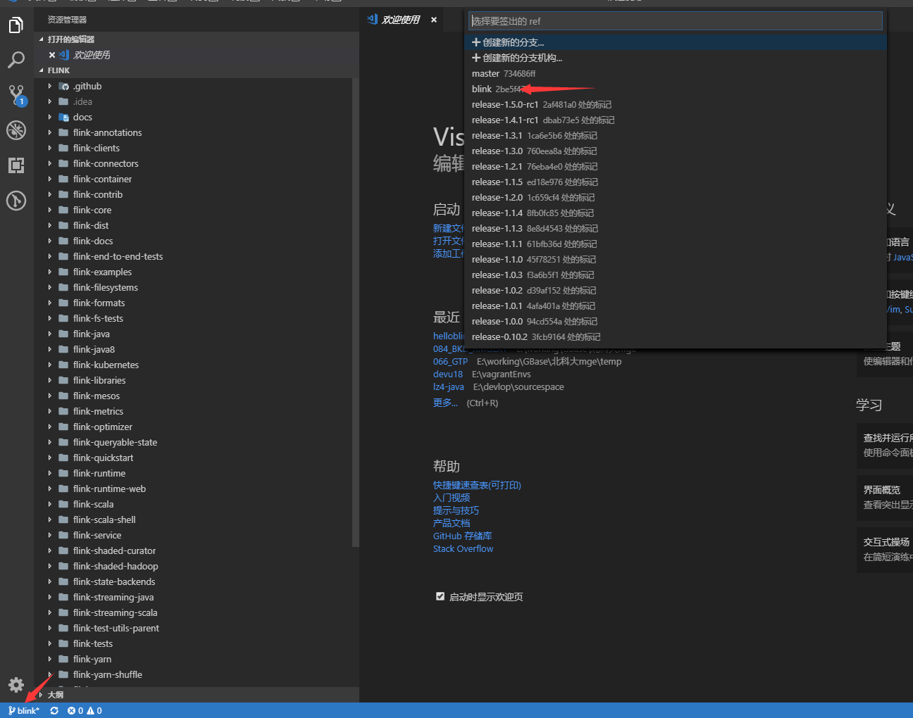
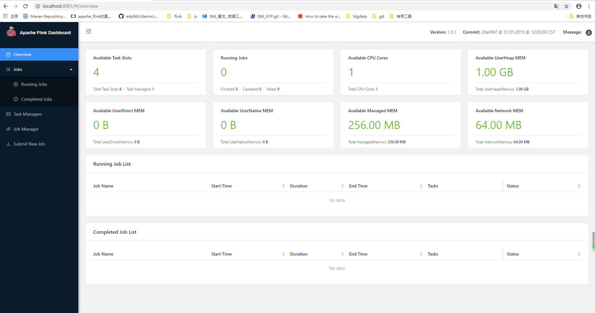
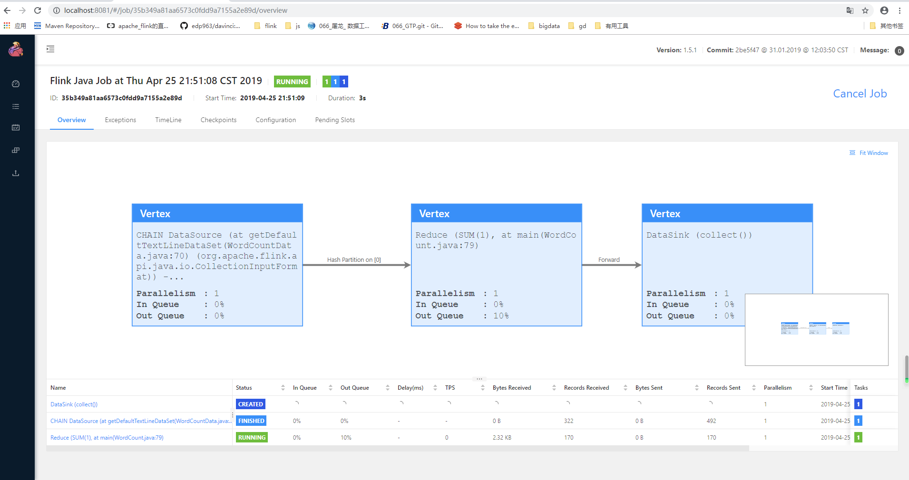
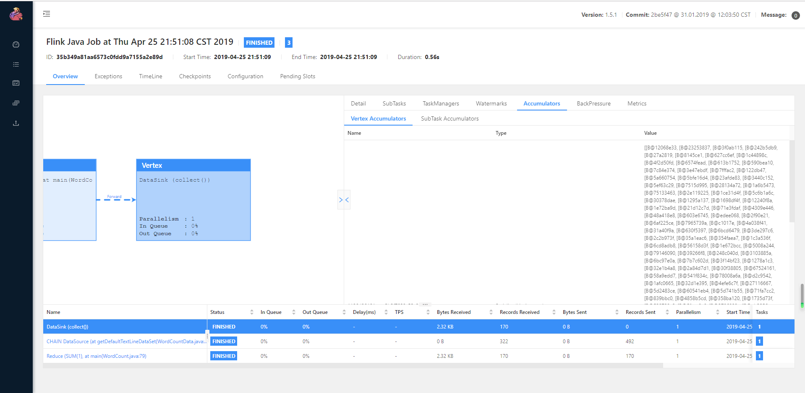
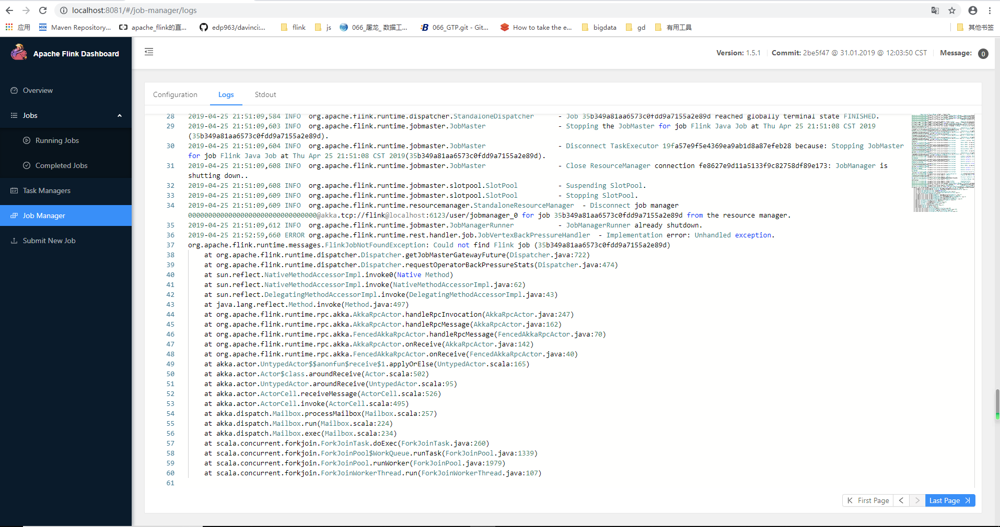
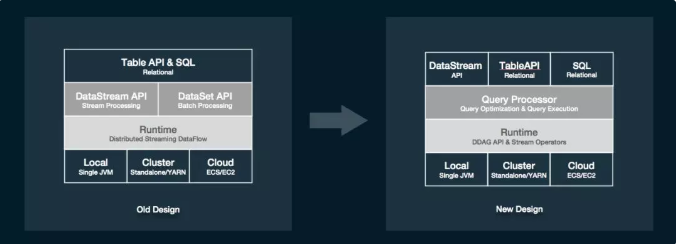

# 尝尝Blink

期待 Flink 1.9 整合 Flink 和 Blink 的版本。突然心血来潮，打算自己编一版 Blink 玩玩，这篇文章分为两个部分：

1. 介绍如何编译Blink，这部分非常简单的入门
2. 介绍一下，我关注blink的点

## 编译Blink

首先，clone仓库

> [https://github.com/apache/flink.git](https://github.com/apache/flink.git)

切换到 Blink 分支

> git checkout blink

看代码的话，墙裂推荐使用 VS Code , 管理 git 相当舒服




打开POM 注释掉，这个是为了避免编译失败

```
<module>flink-yarn-tests</module>
<module>flink-fs-tests</module>
```

如果你上网不够科学，加上阿里云的仓库吧

```
<repository>
	<id>maven-ali</id>
	<url>http://maven.aliyun.com/nexus/content/groups/public//</url>
	<releases>
		<enabled>true</enabled>
	</releases>
	<snapshots>
		<enabled>true</enabled>
		<updatePolicy>always</updatePolicy>
		<checksumPolicy>fail</checksumPolicy>
	</snapshots>
</repository>
```

执行编译

> mvn clean install -Dmaven.test.skip -Dcheckstyle.skip -Dlicense.skip=true -Drat.ignoreErrors=true

经过漫长的等待

```
[INFO] Reactor Summary:
[INFO] 
[INFO] force-shading ...................................... SUCCESS [  3.950 s]
[INFO] flink .............................................. SUCCESS [01:03 min]
[INFO] flink-annotations .................................. SUCCESS [  2.049 s]
[INFO] flink-shaded-hadoop ................................ SUCCESS [  0.103 s]
[INFO] flink-shaded-hadoop2 ............................... SUCCESS [ 12.594 s]
[INFO] flink-shaded-hadoop2-uber .......................... SUCCESS [ 14.808 s]
[INFO] flink-shaded-yarn-tests ............................ SUCCESS [ 13.040 s]
[INFO] flink-shaded-curator ............................... SUCCESS [  0.921 s]
[INFO] flink-test-utils-parent ............................ SUCCESS [  0.124 s]
[INFO] flink-test-utils-junit ............................. SUCCESS [  0.902 s]
[INFO] flink-metrics ...................................... SUCCESS [  0.124 s]
[INFO] flink-metrics-core ................................. SUCCESS [  3.522 s]
[INFO] flink-core ......................................... SUCCESS [ 15.602 s]
[INFO] flink-java ......................................... SUCCESS [  9.191 s]
[INFO] flink-queryable-state .............................. SUCCESS [  0.962 s]
[INFO] flink-queryable-state-client-java .................. SUCCESS [  3.069 s]
[INFO] flink-filesystems .................................. SUCCESS [  0.103 s]
[INFO] flink-hadoop-fs .................................... SUCCESS [  4.955 s]
[INFO] flink-metrics-dropwizard ........................... SUCCESS [  1.979 s]
[INFO] flink-runtime ...................................... SUCCESS [ 57.828 s]
[INFO] flink-optimizer .................................... SUCCESS [  3.709 s]
[INFO] flink-clients ...................................... SUCCESS [  3.399 s]
[INFO] flink-streaming-java ............................... SUCCESS [  8.376 s]
[INFO] flink-scala ........................................ SUCCESS [ 27.133 s]
[INFO] flink-examples ..................................... SUCCESS [  0.598 s]
[INFO] flink-examples-batch ............................... SUCCESS [ 16.918 s]
[INFO] flink-test-utils ................................... SUCCESS [  5.793 s]
[INFO] flink-state-backends ............................... SUCCESS [  0.108 s]
[INFO] flink-statebackend-rocksdb ......................... SUCCESS [  2.727 s]
[INFO] flink-libraries .................................... SUCCESS [  0.100 s]
[INFO] flink-cep .......................................... SUCCESS [  2.149 s]
[INFO] flink-java8 ........................................ SUCCESS [  2.744 s]
[INFO] flink-mapr-fs ...................................... SUCCESS [  2.738 s]
[INFO] flink-s3-fs-hadoop ................................. SUCCESS [ 17.525 s]
[INFO] flink-s3-fs-presto ................................. SUCCESS [ 19.891 s]
[INFO] flink-swift-fs-hadoop .............................. SUCCESS [ 17.337 s]
[INFO] flink-runtime-web .................................. SUCCESS [01:42 min]
[INFO] flink-connectors ................................... SUCCESS [  0.077 s]
[INFO] flink-hadoop-compatibility ......................... SUCCESS [  6.473 s]
[INFO] flink-yarn ......................................... SUCCESS [  8.879 s]
[INFO] flink-yarn-shuffle ................................. SUCCESS [  6.237 s]
[INFO] flink-tests ........................................ SUCCESS [  2.834 s]
[INFO] flink-streaming-scala .............................. SUCCESS [  8.994 s]
[INFO] flink-table-common ................................. SUCCESS [  1.497 s]
[INFO] flink-python ....................................... SUCCESS [  1.887 s]
[INFO] flink-service ...................................... SUCCESS [  0.696 s]
[INFO] flink-table ........................................ SUCCESS [01:58 min]
[INFO] flink-orc .......................................... SUCCESS [  2.527 s]
[INFO] flink-jdbc ......................................... SUCCESS [  1.426 s]
[INFO] flink-hbase ........................................ SUCCESS [  8.836 s]
[INFO] flink-hcatalog ..................................... SUCCESS [  6.174 s]
[INFO] flink-formats ...................................... SUCCESS [  0.102 s]
[INFO] flink-avro ......................................... SUCCESS [  3.269 s]
[INFO] flink-json ......................................... SUCCESS [  1.709 s]
[INFO] flink-metrics-jmx .................................. SUCCESS [  1.229 s]
[INFO] flink-connector-kafka-base ......................... SUCCESS [  5.958 s]
[INFO] flink-connector-kafka-0.8 .......................... SUCCESS [  6.160 s]
[INFO] flink-connector-kafka-0.9 .......................... SUCCESS [  6.833 s]
[INFO] flink-connector-kafka-0.10 ......................... SUCCESS [  5.851 s]
[INFO] flink-connector-kafka-0.11 ......................... SUCCESS [  9.838 s]
[INFO] flink-connector-elasticsearch-base ................. SUCCESS [  9.183 s]
[INFO] flink-connector-elasticsearch ...................... SUCCESS [ 11.425 s]
[INFO] flink-connector-elasticsearch2 ..................... SUCCESS [ 16.474 s]
[INFO] flink-connector-elasticsearch5 ..................... SUCCESS [ 12.188 s]
[INFO] flink-connector-rabbitmq ........................... SUCCESS [  1.235 s]
[INFO] flink-connector-twitter ............................ SUCCESS [  2.843 s]
[INFO] flink-connector-nifi ............................... SUCCESS [  1.557 s]
[INFO] flink-connector-cassandra .......................... SUCCESS [  3.526 s]
[INFO] flink-connector-filesystem ......................... SUCCESS [  2.506 s]
[INFO] flink-connector-hive ............................... SUCCESS [ 10.424 s]
[INFO] flink-examples-streaming ........................... SUCCESS [ 11.537 s]
[INFO] flink-examples-table ............................... SUCCESS [ 10.962 s]
[INFO] flink-queryable-state-runtime ...................... SUCCESS [  1.331 s]
[INFO] flink-end-to-end-tests ............................. SUCCESS [  0.097 s]
[INFO] flink-parent-child-classloading-test ............... SUCCESS [  0.978 s]
[INFO] flink-dataset-allround-test ........................ SUCCESS [  0.722 s]
[INFO] flink-datastream-allround-test ..................... SUCCESS [  1.591 s]
[INFO] flink-bucketing-sink-test .......................... SUCCESS [  1.795 s]
[INFO] flink-high-parallelism-iterations-test ............. SUCCESS [  7.251 s]
[INFO] flink-stream-stateful-job-upgrade-test ............. SUCCESS [  3.547 s]
[INFO] flink-local-recovery-and-allocation-test ........... SUCCESS [  2.437 s]
[INFO] flink-elasticsearch1-test .......................... SUCCESS [  4.130 s]
[INFO] flink-elasticsearch2-test .......................... SUCCESS [  3.037 s]
[INFO] flink-elasticsearch5-test .......................... SUCCESS [  6.161 s]
[INFO] flink-distributed-cache-via-blob-test .............. SUCCESS [  0.979 s]
[INFO] flink-gelly ........................................ SUCCESS [  3.699 s]
[INFO] flink-gelly-scala .................................. SUCCESS [ 10.951 s]
[INFO] flink-gelly-examples ............................... SUCCESS [  7.763 s]
[INFO] flink-sql-parser ................................... SUCCESS [ 21.362 s]
[INFO] flink-sql-client ................................... SUCCESS [  5.935 s]
[INFO] flink-ml ........................................... SUCCESS [ 31.070 s]
[INFO] flink-cep-scala .................................... SUCCESS [  5.978 s]
[INFO] flink-streaming-python ............................. SUCCESS [  5.429 s]
[INFO] flink-scala-shell .................................. SUCCESS [  6.886 s]
[INFO] flink-quickstart ................................... SUCCESS [  1.459 s]
[INFO] flink-quickstart-java .............................. SUCCESS [  0.978 s]
[INFO] flink-quickstart-scala ............................. SUCCESS [  0.433 s]
[INFO] flink-contrib ...................................... SUCCESS [  0.099 s]
[INFO] flink-connector-wikiedits .......................... SUCCESS [  1.367 s]
[INFO] flink-container .................................... SUCCESS [  0.634 s]
[INFO] flink-mesos ........................................ SUCCESS [ 12.866 s]
[INFO] flink-metrics-ganglia .............................. SUCCESS [  0.779 s]
[INFO] flink-metrics-graphite ............................. SUCCESS [  0.810 s]
[INFO] flink-metrics-prometheus ........................... SUCCESS [  1.382 s]
[INFO] flink-metrics-statsd ............................... SUCCESS [  0.788 s]
[INFO] flink-metrics-datadog .............................. SUCCESS [  0.563 s]
[INFO] flink-metrics-slf4j ................................ SUCCESS [  0.739 s]
[INFO] flink-kubernetes ................................... SUCCESS [  3.697 s]
[INFO] flink-docs ......................................... SUCCESS [  2.656 s]
[INFO] flink-dist ......................................... SUCCESS [ 57.941 s]
[INFO] ------------------------------------------------------------------------
[INFO] BUILD SUCCESS
[INFO] ------------------------------------------------------------------------
[INFO] Total time: 16:20 min
[INFO] Finished at: 2019-04-25T21:35:28+08:00
[INFO] Final Memory: 442M/2717M
[INFO] ------------------------------------------------------------------------
```

终于编译好了。编译好的工程在 `flink-dist` 里，进入 

> flink-dist\target\flink-1.5.1-bin\flink-1.5.1\bin

执行

> start-cluster.bat

稍微等待一下,web访问

> http://localhost:8081/










## 关注点

1. SQL/TableAPI



```
首先，我们对 SQL engine 的架构做了较大的调整。提出了全新的 Query Processor（QP）， 它包括了一个优化层（Query Optimizer）和一个算子层（Query Executor）。这样一来，流计算和批计算的在这两层大部分的设计工作就能做到尽可能地复用。另外，SQL 和 TableAPI 的程序最终执行的时候将不会翻译到 DataStream 和 DataSet 这两个 API 上，而是直接构建到可运行的 DAG 上来，这样就使得物理执行算子的设计不完全依赖底层的 API，有了更大的灵活度，同时执行代码也能够被灵活的 codegen 出来。

唯一的一个影响就是这个版本的 SQL 和 TableAPI 不能和 DataSet 这个 API 进行互相转换，但仍然保留了和 DataStream API 互相转换的能力（将 DataStream 注册成表，或将 Table 转成 DataStream 后继续操作）。未来，我们计划把 dataset 的功能慢慢都在 DataStream 和 TableAPI 上面实现。到那时 DataStream 和 SQL 以及 tableAPI 一样，是一个可以同时描述 bounded 以及 unbounded processing 的 API。

除了架构上的重构，Blink 还在具体实现上做了较多比较大的重构。

首先，Blink 引入了二进制的数据结构 BinaryRow，极大的减少了数据存储上的开销以及数据在序列化和反序列化上计算的开销。

其次，在算子的实现层面，Blink 在更广范围内引入了 CodeGen 技术。由于预先知道算子需要处理的数据的类型，在 QP 层内部就可以直接生成更有针对性更高效的执行代码。Blink 的算子会动态的申请和使用资源，能够更好的利用资源，提升效率，更加重要的是这些算子对资源有着比较好的控制，不会发生 OutOfMemory 的问题。

此外，针对流计算场景，Blink 加入了 miniBatch 的执行模式，在 aggregate、join 等需要和 state 频繁交互且往往又能先做部分 reduce 的场景中，使用 miniBatch 能够极大的减少 IO，从而成数量级的提升性能。除了上面提到的这些重要的重构和功能点，Blink 还实现了完整的 SQL DDL，带 emit 策略的流计算 DML，若干重要的 SQL 功能，以及大量的性能优化策略。

有了上面提到的诸多架构和实现上的重构。Blink 的 SQL／tableAPI 在功能和性能方面都取得了脱胎换骨的变化。在批计算方面，首先 Blink batch SQL 能够完整地跑通 TPC-H 和 TPC-DS，且性能上有了极大的提升。
```   

在扒代码的时候，在`flink-libraries`下发现了两个有意思的新工程，这股市是上面提到部分SQL解析相关的工程，日后可以研读一下

```
flink-sql-client
flink-sql-parser
```


2. Zeppelin for Flink
   
```
为了提供更好的可视化和交互式体验，我们做了大量的工作让 Zeppelin 能够更好的支持 Flink。这些改动有些是在 Flink 上的，有些是在 Zeppelin 上的。在这些改动全部推回 Flink 和 Zeppelin 社区之前，大家可以使用这个 Zeppelin image (具体细节请参考 Blink 代码里的 docs/quickstart/zeppelin_quickstart.md) 来测试和使用这些功能。

这个用于测试的 Zeppelin 版本，首先很好地融合和集成了 Flink 的多种运行模式以及运维界面。使用文本 SQL 和 tableAPI 可以自如的查询 Flink 的 static table 和 dynamic table。此外，针对 Flink 的流计算的特点，这一版 Zeppelin 也很好地支持了 savepoint，用户可以在界面上暂停作业，然后再从 savepoint 恢复继续运行作业。

在数据展示方面，除了传统的数据分析界面，我们也添加了流计算的翻牌器和时间序列展示等等功能。为了方便用户试用，我们在这一版 zeppelin 中提供 3 个 built-in 的 Flink tutorial 的例子: 一个是做 Streaming ETL 的例子, 另外两个分别是做 Flink Batch, Flink Stream 的基础样例。
```


zeppelin 一直是我非常欣赏的项目，最近一两年里，我总是在构想如何想把他运用到BI或其他领域的产品中，只是一直没能如愿，希望日后有机会能够完成这个心愿。
